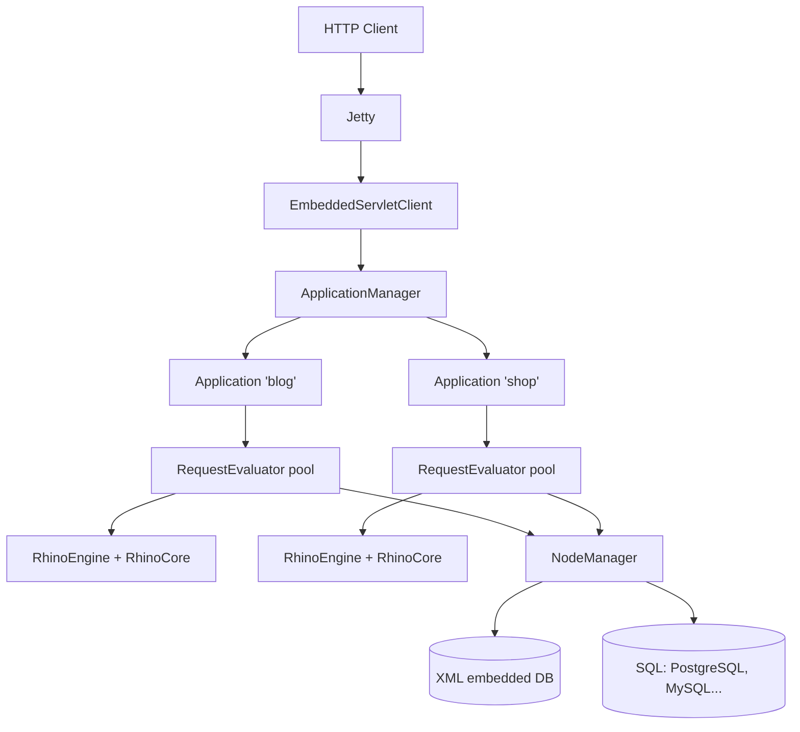

# Architecture Overview

Helma is a layered system: a `Server` boots, loads each `Application`, each application owns a pool of `RequestEvaluator` threads, each evaluator owns one `ScriptingEngine` instance. Below the framework sits the `NodeManager` which talks to both the embedded XML database and external SQL databases via the `DbSource` / `DbMapping` machinery.

## Top-Level Components



## Server (`helma.main.Server`)

The top-level object. One per JVM. Reads `server.properties`, starts Jetty, loads Java extensions, registers the shutdown hook, and asks the `ApplicationManager` to start applications listed in `apps.properties`.

Lifecycle (from `src/main/java/helma/main/Server.java:117`):

```text
main(args)
  → loadServer(args)          (config + checkJavaVersion)
  → init()                    (read props, start Jetty)
  → start()                   (start ApplicationManager + worker thread)
```

Key fields:

- `sysProps` — `server.properties` (parsed `ResourceProperties`)
- `appsProps` — `apps.properties` (which apps to start)
- `dbProps` — server-wide `db.properties` (default DB sources)
- `jetty` — `JettyServer`
- `dbSources` — global pool of `DbSource` objects
- `extensions` — list of `HelmaExtension` instances loaded from `server.properties` `extensions=` setting

## Application Manager (`helma.main.ApplicationManager`)

Polls `apps.properties` for added/removed applications, starts and stops them. Each entry maps to one `Application` object. An application can be:

- Started: a fully-initialised `Application` is running with its evaluator pool active.
- Stopped: the `Application` exists but its evaluator pool is shut down.

## Application (`helma.framework.core.Application`)

The central object of one Helma application. Owns:

- `repositories` — list of code sources (file dirs, zip files)
- `props` — `app.properties` (`ResourceProperties` overlaying `server.properties`)
- `dbProps` — `db.properties` (`ResourceProperties` overlaying server-wide)
- `nmgr` — `NodeManager` for the object model
- `sessionMgr` — the session store
- `typemgr` — the `TypeManager` watching prototype directories
- `skinmgr` — the `SkinManager`
- `freeThreads`, `allThreads` — `RequestEvaluator` pool
- `activeRequests` — `Hashtable<RequestTrans, RequestEvaluator>` to coalesce identical concurrent requests
- `activeCronJobs`, `customCronJobs` — registered scheduled functions
- `eventLog`, `accessLog` — per-app commons-logging loggers

Each Application runs a *worker thread* (`Thread worker`) that handles:

- Session cleanup (every 60s, scans for sessions older than `sessionTimeout`)
- Cron job dispatch (every minute, checks `CronJob.appliesToDate(now)`)
- Embedded DB persist scheduling

## Request Evaluator (`helma.framework.core.RequestEvaluator`)

One thread + one scripting engine = one *evaluator*. Each evaluator runs in a loop:

1. Wait for a request (blocked on `wait()` in `notifyAndWait()`)
2. Once woken, process the request via the `run()` method
3. On completion, return to the pool

Concurrent requests use different evaluators. The pool size is controlled by `maxThreads` in `app.properties`. If the pool is exhausted, additional requests queue.

Pseudo-code of one iteration (full implementation at `src/main/java/helma/framework/core/RequestEvaluator.java:141`):

```text
loop:
  txn = Transactor.getInstance(nmgr).begin(txname)
  scriptingEngine.enterContext()
  try:
    if reqtype == HTTP:
      resolve path → currentElement, action
      invoke onRequest(currentElement)
      invoke action(currentElement)
      invoke onResponse(currentElement)
    elif reqtype == EXTERNAL or INTERNAL:
      invoke function on thisObject
    commitTransaction()
  except ConcurrencyException:
    retry with exponential backoff up to 8 times
  except Throwable as e:
    if no error template yet: error = e; rerun loop with /error action
    else: emit minimal error response
  finally:
    scriptingEngine.exitContext()
  notifyAndWait()  # block until next request
```

## Scripting Engine (`helma.scripting.ScriptingEngine`)

An interface; the only implementation is `helma.scripting.rhino.RhinoEngine`. Each `RequestEvaluator` owns one `RhinoEngine`. All evaluators of an application share a `RhinoCore` which holds the compiled prototypes.

Rhino architecture:

- **Shared scope** — `RhinoCore.global` — holds compiled prototype constructors and parent prototypes.
- **Per-thread scope** — `GlobalObject` with `isThreadScope=true` — child of the shared scope. Per-request globals (`req`, `res`, `session`, `path`, `app`) live here.
- **Prototype map** — `RhinoCore.prototypes` — `Map<String, TypeInfo>`. Each TypeInfo wraps a `Prototype` and its compiled `HopObject` JS prototype.

## Node Manager (`helma.objectmodel.db.NodeManager`)

Coordinates object persistence. Manages:

- A `Hashtable<Key, Node>` LRU cache (`cache`) of nodes loaded from DB
- The embedded `IDatabase` (XML DB)
- All `DbSource`s for external relational DBs
- Transactions via `Transactor`

When you call `node.getChild("alice")`:

1. NodeManager builds a `Key` from `(prototype, name, parent)`
2. Looks in the cache
3. On miss, reads from the DB layer indicated by the prototype's `DbMapping`
4. Wraps the result in a `Node` and inserts into the cache

## Transactor (`helma.objectmodel.db.Transactor`)

A `ThreadLocal` transaction context. Each request runs inside one `Transactor.begin()` → `commit()`/`abort()` cycle. When `_idgen=[hop]` or no relational mapping is set, the transactor flushes dirty `Node`s to the embedded DB; for relational mappings it commits the JDBC connection associated with each touched DbSource.

## Session Manager (`helma.framework.core.SessionManager`)

A `Hashtable<String, Session>` keyed by session cookie. The worker thread sweeps expired sessions every 60 seconds; sessions can be persisted to disk via `storeSessionData()` so they survive a restart.

## Type Manager (`helma.framework.core.TypeManager`)

Watches every prototype directory across every registered repository. On each request, the active `RhinoEngine.enterContext()` calls `RhinoCore.updatePrototypes()` which asks the `TypeManager` if anything changed. If yes, the prototype's `.js` files are recompiled into the shared scope.

This is what gives Helma its **hot reload** behaviour.

## Embedded Web Server (`JettyServer`)

A thin wrapper around `org.eclipse.jetty.server.Server`. Either uses an XML configuration file (the `-c` flag) or a programmatic single-connector setup. Default settings:

- Sends no `Server` header
- Sends no `Date` header
- Idle timeout 30 seconds
- No accept-queue limit

Jetty hosts a single `AbstractServletClient` per application (see `src/main/java/helma/servlet/`):

- `EmbeddedServletClient` — the servlet bridge used when Jetty and Helma share the JVM (the only supported mode)

## Class Loading

Each application has its own `AppClassLoader` (`src/main/java/helma/framework/core/AppClassLoader.java`). It is a child of the JVM system class loader and additionally loads `.jar` files placed under `apps/<app>/lib/`. This lets each app pin its own version of a dependency without conflict.

## Putting It Together

A typical request:

1. Jetty hands the `HttpServletRequest` to `EmbeddedServletClient.service()`.
2. The servlet builds a `RequestTrans` and gets-or-creates the `Session` keyed by cookie.
3. It calls `Application.execute(req, session)` which:
    - Grabs a free `RequestEvaluator`
    - Calls `evaluator.invokeHttp(req, session)` and blocks (up to `requestTimeout`)
4. The evaluator's transactor thread runs the loop, populating `ResponseTrans`.
5. On return, the servlet flushes the response buffer to the client.

See [Request Lifecycle](request-lifecycle.md) for the deep dive.
