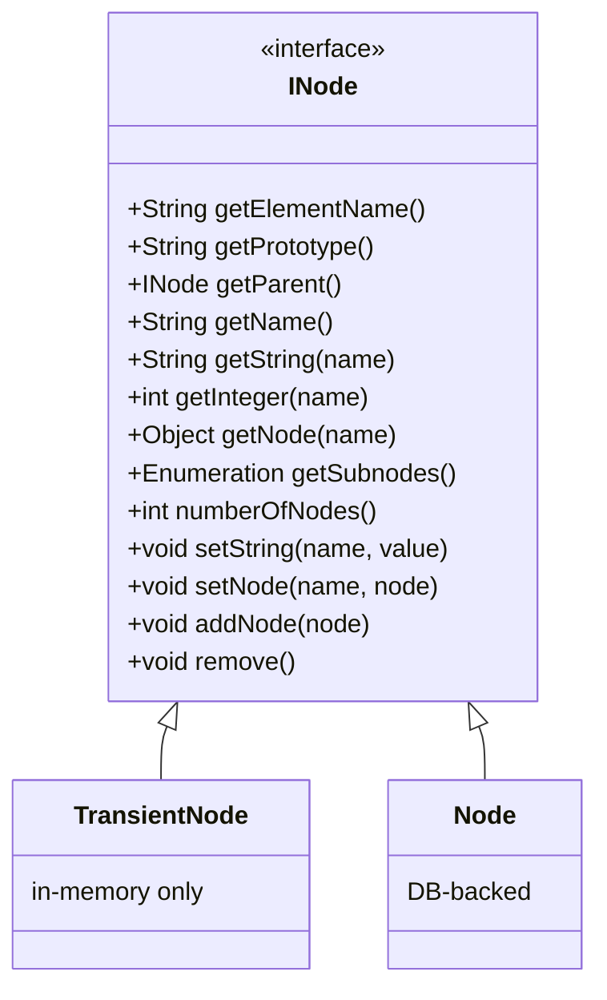

# Object Model

The object model is Helma's killer feature. It exposes a single uniform interface — the **HopObject** — for objects that are:

- Transient (in memory only)
- Persisted to the embedded XML database
- Mapped to a relational SQL table

…and lets you treat them all the same way from JavaScript.

## The Three Interfaces



| Class | Location | Storage | When |
|---|---|---|---|
| `INode` | `helma.objectmodel.INode` | — | Interface, the common API |
| `TransientNode` | `helma.objectmodel.TransientNode` | Java heap | `new HopObject()` without a DB mapping |
| `Node` | `helma.objectmodel.db.Node` | Embedded XML DB or SQL DB | All persistent objects |

From JavaScript you always see a `HopObject`, which wraps an `INode`. The HopObject API is the same regardless of underlying storage.

## HopObject Properties

Every HopObject has three kinds of properties:

| Kind | Stored as | Persisted | Example |
|---|---|---|---|
| **Property** | Field on the node | Yes | `post.title = "Hi"` |
| **Child** | Sub-node | Yes (parent/child link) | `post.add(comment)` |
| **Cached** | Transient cache node | No | `post.cache.foo = "tmp"` |

```javascript
var post = new Post();

// Properties — persisted
post.title = "Hello world";
post.body  = "Long content...";
post.created = new Date();

// Children — persisted with parent/child link
var comment = new Comment();
comment.text = "Nice!";
post.add(comment);          // post now has comment as a child

// Cache node — transient, per-instance
post.cache.preview = post.body.substring(0, 100);

// Access patterns
post.title              // → "Hello world"
post.get(0)             // → first child (the comment)
post.size()             // → 1
post.list()             // → all children as Array
post.get("comment-id")  // → child by name/id
```

## The Embedded Database (XML)

When a prototype has *no* `type.properties` (or only `_idgen = [hop]`), HopObjects of that prototype are persisted to the embedded **XML database** in `db/<appname>/`.

How it works:

- Each Node is serialized to one XML file
- Files are named `<id>.xml` where `<id>` is the node's internal ID
- Parent/child relations are stored as `<helma:child id="..."/>` entries inside the parent's XML
- Property values are stored as `<property name="..."><string>...</string></property>` (or `<int>`, `<float>`, `<date>`, `<node>`)
- The `XmlDatabase` class handles persistence; see `src/main/java/helma/objectmodel/dom/XmlDatabase.java`

The XML DB is **not** a queryable database. You can only access nodes by parent/child traversal or by ID. For anything beyond simple parent/child structures, use a real SQL DB via [Type Properties](../database/type-properties.md).

## Relational Mapping

When a prototype has a `type.properties` file with `_db`, `_table`, and column mappings, its HopObjects become rows in a SQL table:

```properties
# Post/type.properties
_db = main
_table = posts
_id = post_id
_idgen = [uuid]

title = title
body = body
author.object = User
author.local = author_id
author.foreign = user_id
comments.collection = Comment
comments.local = post_id
comments.foreign = post_id
```

`new Post()` then inserts a row when the transaction commits; `post.title = "..."` triggers an `UPDATE`; `post.remove()` triggers `DELETE`.

Helma generates SQL on demand:

| Operation | SQL |
|---|---|
| Load by ID | `SELECT * FROM posts WHERE post_id = ?` |
| Save new | `INSERT INTO posts (post_id, title, body, author_id) VALUES (?, ?, ?, ?)` |
| Update | `UPDATE posts SET title = ?, body = ? WHERE post_id = ?` |
| Delete | `DELETE FROM posts WHERE post_id = ?` |
| Children | `SELECT * FROM comments WHERE post_id = ? ORDER BY created` |

For more complex queries, use `app.getDbSource("main").getConnection()` and write SQL directly — see [Custom Queries](../database/queries.md).

## Relations

A *relation* describes how a property links to another HopObject. The four relation types (`Relation.java:36`):

| Type | Constant | Meaning | Example |
|---|---|---|---|
| `PRIMITIVE` | 0 | Scalar column (string, int, date) | `title = title` |
| `REFERENCE` | 1 | 1-to-1 reference by foreign key | `author.object = User` |
| `COLLECTION` | 2 | 1-to-many child list | `comments.collection = Comment` |
| `COMPLEX_REFERENCE` | 3 | Reference with multiple constraints | `manager.object = User` with multi-column key |

A collection becomes a **subnode list** — accessible via `post.size()`, `post.get(i)`, `post.list()`, iteration with `for each`.

## Loading and Caching

HopObjects are loaded lazily. `post.author` causes a single SQL `SELECT` against the `users` table — but only the first time. After that the Node is cached in the `NodeManager` LRU cache.

Cache eviction:

- LRU based on `cacheSize` in `app.properties` (default 1000 nodes)
- On node modification, the entry is replaced; on `delete`, removed
- On a global cache clear (`app.clearCache()`)

Cached references are weak — if you have a stale reference to a node that has been evicted, accessing it will re-fetch from the DB transparently.

## Virtual Nodes

A prototype can declare *virtual* sub-nodes that are not real DB rows but logical collections. The most common is the `_children` collection on Root with a filter:

```properties
# Root/type.properties
recentPosts.collection = Post
recentPosts.order = created desc
recentPosts.maxSize = 10
```

`root.recentPosts` is a virtual node — it doesn't exist as a row but acts as a query: "the 10 most recent posts". Iterating it executes a single SQL query.

You can nest virtual nodes; `root.recentPosts.size()` issues `SELECT COUNT(*) FROM posts`.

## Cache Nodes

Every HopObject has a `cache` property that is a transient cache node — useful for storing computed values that should not persist:

```javascript
function expensiveLookup() {
    if (this.cache.cached === undefined) {
        this.cache.cached = someExpensiveCall();
    }
    return this.cache.cached;
}
```

`cache` is a `TransientNode` per HopObject, and is cleared when the HopObject is evicted from the cache.

## Cross-Cutting: `app.data`

`app.data` is an application-wide transient node, shared across all evaluator threads. Use it to store shared in-memory state (counters, caches, runtime config). It is a `TransientNode` — not persisted.

```javascript
function incrementHitCount() {
    app.data.hits = (app.data.hits || 0) + 1;
}
```

The `Hashtable`-backed implementation makes property access thread-safe, but **read-modify-write is not atomic**. Use `app.invoke()` or explicit synchronisation for critical sections.

## Persistence Triggers

Helma writes a Node to the DB when:

- `Transactor.commit()` runs at end of request, AND
- The Node is marked dirty (any setter, `add()`, `remove()` call)

You can force persistence mid-request with `node.persist()`. Useful when you need the ID before the transaction commits (e.g. to use as a foreign key in another row inserted in the same transaction).

`onPersist()` is called immediately before the row is written, giving you a hook to set `modified` timestamps or compute derived columns.
