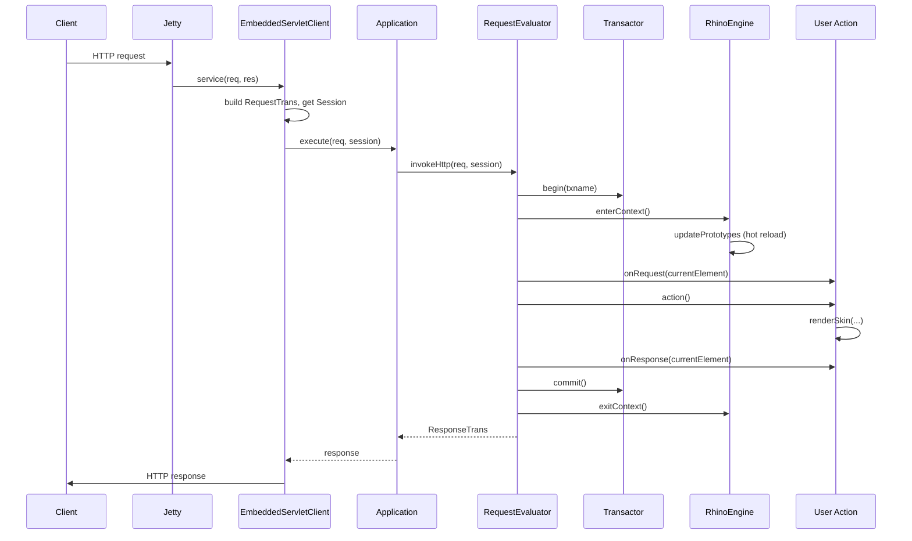

# Request Lifecycle

This page traces an HTTP request from the wire to the response, naming every class involved.



## Phase 1 — Servlet ingest

`EmbeddedServletClient.service()` builds a `RequestTrans` from the `HttpServletRequest`:

- `req.method` = HTTP method
- `req.path` = path-info, with the app's mountpoint stripped
- `req.uri` = full URI
- `req.queryParams`, `req.postParams`, `req.cookies` = parsed
- `req.data` map gets `http_host`, `http_referer`, `http_remotehost`, `http_browser`, `http_language` headers
- `If-Modified-Since` and `If-None-Match` are decoded for conditional GETs

Multipart `POST` requests are parsed via Apache Commons FileUpload; uploaded files become `MimePart` objects in `req.postParams`.

## Phase 2 — Session resolution

The servlet:

1. Reads the session cookie (default `HopSession`)
2. Calls `app.checkSession(cookie)` to get-or-create the `Session`
3. Calls `session.touch()` to bump `lastTouched`

Sessions are managed by `SessionManager`. Anonymous sessions are not registered in the manager until `session.commit()` runs (and only if state changed or login happened) — a free anonymous browser does not accumulate sessions in memory.

## Phase 3 — Dispatch to evaluator

`Application.execute(req, session)` does:

```text
existing = activeRequests.get(req)
if existing:
    return existing.attachHttpRequest(req)   # piggyback on running identical request
re = getEvaluator()                          # blocks until one is free
activeRequests.put(req, re)
try:
    return re.invokeHttp(req, session)
finally:
    activeRequests.remove(req)
    releaseEvaluator(re)
```

**Request coalescing**: if a second identical request arrives while the first is still running, Helma does *not* run it twice. The second waiter attaches to the first evaluator's `ResponseTrans`. This is invaluable when a slow page is requested repeatedly during cache miss.

## Phase 4 — Transactor begin

`Transactor.getInstance(nmgr).begin(txname)`:

- Establishes a `ThreadLocal` transaction binding
- Starts a fresh dirty-node tracking set (for the embedded DB)
- Acquires DB connections lazily on first access

## Phase 5 — Scripting engine context entry

`RhinoEngine.enterContext()`:

1. Sets `this.thread = currentThread`
2. Creates a fresh per-thread `GlobalObject` whose prototype is the shared `RhinoCore.global`
3. Enters a Rhino `Context` from the shared `ContextFactory`
4. Optionally attaches a `Tracer` (if `tracer = true`) or `Profiler` (if `profile = true`)
5. Calls `core.updatePrototypes()` — this is where **hot reload** happens. If any `.js` or `type.properties` file in any prototype directory changed since the last context, the corresponding prototype is recompiled into the shared scope.

## Phase 6 — Path resolution

The evaluator walks `req.path` segment by segment, starting from the application root object.

```text
currentElement = app.getDataRoot()
requestPath.add(null, currentElement)

for each segment in path:
    if last segment and path does not end with '/':
        action = getAction(currentElement, segment, req)
        if action found: break
    currentElement = getChildElement(currentElement, segment)
    requestPath.add(segment, currentElement)
```

`getChildElement()` calls `currentElement.getChildElement(segment)` which:

- For a `Node` (DB-backed): does a `_children` collection lookup using `Relation.getAccessName()` or by name
- For a transient node: does a property lookup

If `getChildElement()` returns `null`, the request fails with `NotFoundException` and the evaluator re-enters the loop with `action = "notfound"` (or whatever `notfound` property in `app.properties` is set to).

After the path is resolved, the action function is determined. See [Actions](../framework/actions.md) for the full lookup order including AJAX, POST and method-specific variants.

## Phase 7 — Register macro handlers

The `requestPath` becomes the basis for macro resolution. For each object in the path, its prototype name is registered in `res.handlers`. This is what makes `<% post.title %>` work inside the Root skin: `post` resolves to the `Post` HopObject in the request path.

`Prototype.registerParents()` additionally registers each path object under its parent prototype names — so a `BlogPost extends Post` HopObject is reachable as `<% post.* %>` AND `<% blogpost.* %>`.

## Phase 8 — onRequest hook

Before the action runs, the evaluator invokes `onRequest()` on `currentElement` if defined. This is where you typically check authorisation, set up `res.skinpath`, or override the action via `req.actionHandler = ...`.

## Phase 9 — Action invocation

`scriptingEngine.invoke(currentElement, action, args, ARGS_WRAP_DEFAULT, false)`:

- For HTTP: `args = []`, the action is a function-name string like `main_action`
- For EXTERNAL (`app.invoke(...)`, command line): `ARGS_WRAP_EXTERNAL` marshals args/return values between generic Java collections and the scripting runtime
- For INTERNAL: function may be a direct `Function` object, args are passed through

The action returns `undefined` — output is built by `res.write()` and `renderSkin()` calls. Return values are only meaningful for INTERNAL and EXTERNAL invocations.

## Phase 10 — onResponse hook

After the action, `onResponse()` on `currentElement` fires (if defined). Use this to post-process the response buffer (e.g. inject debug bar) or finalise cookies.

## Phase 11 — Transaction commit

`commitTransaction()`:

- Validates that the response hasn't been aborted
- Calls `Transactor.commit()` which:
    - Flushes dirty embedded-DB nodes to disk
    - Commits any JDBC connections opened during the request
    - Fires `NodeChangeListener` events
- Releases connections back to the pool

If anything throws inside the action, the evaluator catches and:

- On `ConcurrencyException` (a node was modified by another request): retries up to 8 times with exponential backoff (`800ms * tries + random`)
- On `RedirectException` (from `res.redirect()` or `res.stop()`): commits and returns the redirect response
- On `AbortException` (from `res.abort()`): aborts the transaction silently
- On `NotFoundException`: hands off to the configured `notfound` action
- On any other `Throwable`: hands off to the configured `error` action

## Phase 12 — Exit scripting context

`RhinoEngine.exitContext()` flushes the profiler output (if active), nulls the thread reference, and exits the Rhino context. The per-thread `GlobalObject` is dropped.

## Phase 13 — Response flush

The evaluator returns the `ResponseTrans` to the servlet. The servlet:

1. Writes the status line and headers (`Content-Type`, `Content-Length`, ETag, `Last-Modified`, custom headers)
2. Sets cookies from `res.cookies` and the session cookie
3. Writes the response body (the buffer or a binary payload from `res.writeBinary()`)
4. Sends the `Date` header *if* `notModified` is set or the response is a 304

For 304 Not Modified, `Last-Modified` and `ETag` are conditionally compared against `If-Modified-Since` / `If-None-Match`; if unchanged, no body is sent.

## Phase 14 — Session commit

`session.commit(reval, sessionMgr)`:

- If the session was modified during the request (login, logout, cache node change), registers it with the SessionManager
- Updates `lastModified`

## Timeouts

If the action runs longer than `app.properties::requestTimeout` (default 60 seconds), the servlet's `wait()` unblocks and `RequestEvaluator.stopTransactor()` is called:

1. `Thread.kill()` on the worker thread
2. `scriptingEngine.abort()` to signal Rhino to bail
3. `Transactor.abort()` to roll back
4. Response is replaced with a minimal 500 "Request timed out"

Watch the log: a `Request timeout for thread <name>` entry signals this.

## Internal Invocation

Two other invocation paths exist alongside HTTP:

- **EXTERNAL** — `app.invoke()` and `app.invokeAsync()` — synchronous or async function call without an HTTP origin.
- **INTERNAL** — used internally by the framework: `onLogout`, `onUnhandledMacro`, cron jobs.

All three share the same `run()` loop. The first major distinction is just whether or not to walk `req.path` and look for an action.
